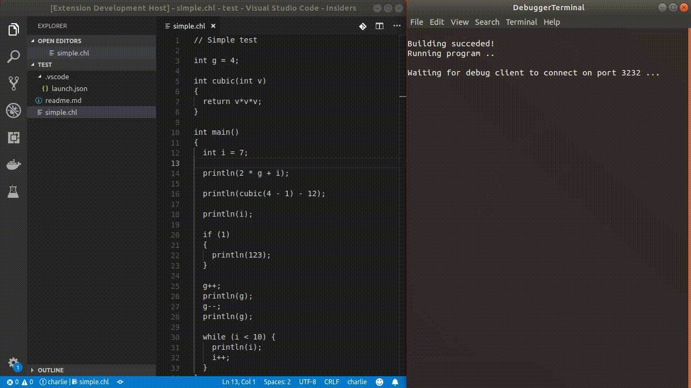

# Charlie

A learning project: Compiles C-Code to Byte-Code and runs it in a virtual machine.



## Prerequisites

* Boost C++ Library
* CMake

## Build

Run `./configure` to create the build directory and the make files.

RUn `cmake --build .` inside the `build-debug` directory to build the binaries into `build-debug/bin` and `build-debug/lib`.

## Usage

### The Console

Type into the console

charlie build where `<entry>` is your entry C++ file in which a `main` function must be defined.
For now the compiler only supports source files. Note the ending `.cc` willl be append to your given filename.

### The Library

Usage example:
``` c++
using namespace charlie;

// Init the Compiler and set the output for compiler messages.
Compiler compiler = Compiler([](string const& message)
{
    cout << message << endl;
});

// Add external function which can be called by the program
compiler.ExternalFunctionManager.AddFunction("print", [](const char *message)
{
    cout << message;
});

// Compile the file "src/main.cc"
compiler.Build("src/main");

// Run the program
compiler.Run();
```


## Supported Features

The [samples](/samples) in show the currently supported features of that tool set. Or [click here](/docs/features.md) for more informations.

## Contributing Code

Please feel welcome to folk this repository.
You will need to download the [Google Test](https://github.com/google/googletest) library in order to run the tests.
If you are using Visual Studio you have to set the system variable `GTEST` to the directory `googletest\googletest`.
